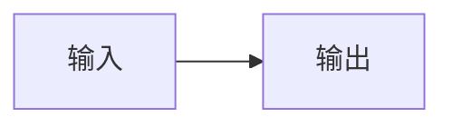

# 量化实习成果看板

这是一个零前端框架的实习成果展示站点。汇报正文由 `content/` 下的 Markdown 构建为静态网页；汇报标签通过 Cloudflare Worker 在线保存，可在网页中随时整理。

## 本地预览

```powershell
D:\MG\anaconda3\python.exe build.py --serve
```

命令会先构建 `dist/`,再启动本地 `http.server`。如果 8000 端口被占用,脚本会自动尝试下一个端口。

## 写一篇日报

在 `content/daily/` 下新增 `YYYY-MM-DD.md`:

```markdown
---
title: "日报标题"
date: 2026-07-08
stage: algo-footprint
summary: "一句话摘要,会显示在时间轴上。"
# 可选: published: 2026-07-08 21:34:12
---

# 日报标题

## 今日目标

正文内容。
```

`stage` 必须使用 `config.json` 中已有的阶段 id。缺失或未知时构建不会中断,但会打印警告并归入 `unclassified`。

发布时间默认来自 git 历史:首次提交时间作为发布时间,最后一次提交时间作为更新时间。若 Cloudflare 浅克隆或历史不可得,构建会降级到文件 mtime 并打印警告。需要稳定控制首次发布时间时,在 frontmatter 中手填 `published: YYYY-MM-DD HH:MM:SS`。

## 为某天写展示版

每篇日报最多配一个展示版,与主日报放在同一目录:

```text
content/daily/2026-07-08.md
content/daily/2026-07-08.show.md
content/daily/2026-07-08.show.html
```

`.show.md` 和 `.show.html` 二选一。两者同时存在时 `.show.html` 生效。

标准写法使用 `.show.md`,每个 H2 是一幕:

```markdown
---
title: "当日成果展示"
---

## 幕一:问题

正文。

## 幕二:构建

??? note "细节"
    折叠内容。
```

完全定制写法使用 `.show.html`,会通过 iframe `srcdoc` 隔离运行,脚本可以执行。定制页应自包含,不要依赖 `<head>` 中的外部引用,也不要引用外部 CDN。模板在 `templates/show-html-starter.html`。

## 更新正式成果页

正式成果放在 `content/showcase/`。每个文件的 frontmatter 至少包含:

```yaml
---
title: "阶段标题"
stage: lv2-snapshot
status: active
---
```

`status` 可用值为 `done`、`active`、`planned`。正文支持表格、代码块、Mermaid 图表、`??? note` 折叠块和 `!!! warning` 提示块。Mermaid 使用标准围栏写法：

````markdown

````

## 发布流程

```powershell
D:\MG\anaconda3\python.exe build.py
git add content config.json README.md DEPLOY.md DECISIONS.md build.py site requirements.txt .gitignore
git commit -m "update dashboard content"
git push
```

Cloudflare Workers Builds 连接 dashboard 仓库后,每次 push 会自动重新构建并部署静态资产。

## 导出离线版

```powershell
D:\MG\anaconda3\python.exe build.py --offline
```

生成的 `dist-offline/` 可以直接打包发送。对方解压后双击 `index.html` 即可浏览。离线版不包含全文搜索,其它内容、路由、Showcase 和 Daily 交互均可用。

## 用标签整理汇报

每日汇报右侧的“汇报一览”显示全部文章，再点一次收起列表。标签横向排列，可滚动；点击标签筛选，再次点击取消。筛选方式可切换为单标签、任意标签（OR）或全部标签（AND），并叠加标题、摘要和日期搜索。“未标记”列出尚未归类的汇报。筛选保留原有倒序和月份分组，上一篇/下一篇只在筛选结果内切换。

右侧编辑图标打开管理面板：

- **汇报归类**：搜索、勾选、批量添加/移除标签。全选只作用于当前筛选结果，改变搜索或筛选会清空勾选。正文顶部“编辑标签”直接定位当前汇报。
- **标签管理**：新增、改名、改色、调整顺序、编辑建议关键词、合并和删除标签。合并迁移全部归属，删除只解除标签关系，正文保留。
- **归类建议**：按标题、摘要和可编辑关键词做本地匹配，显示命中依据；只有勾选并采纳后才添加标签。不会把汇报发送到第三方模型。

操作后自动保存，并可撤销本次打开页面期间最近 30 次修改。所有通过本站 Cloudflare Access 验证的邮箱均可编辑；未登录不能读写标签 API。点击搜索框右侧的 ↗ 复制当前主题链接，链接包含标签 ID、组合方式和搜索词，标签改名不影响该链接。文章上的标签可能有多个，任一标签筛选都能找到它。

线上保存失败时，页面会保留草稿并提供重试。两个窗口同时修改时，旧版本不会覆盖新版本；先导出草稿，再点击“放弃草稿并载入最新”，可将草稿合并导入。导入保留当前标签名称和其他归属，撤销可恢复导入前状态。浏览器禁止本地存储时，失败草稿只保留在内存中，界面会提示导出。

## 标签备份与离线快照

在标签管理面板中点击“导出标签”，保存 JSON 文件。导出包含标签、顺序、颜色、关键词及汇报归属；未保存的修改会标记为草稿。导入会先显示数量，再合并现有数据，不自动覆盖整站分类。

导出线上最新标签后，构建离线版时显式使用该文件：

```powershell
D:\MG\anaconda3\python.exe build.py --offline --tags-snapshot 'C:\path\to\report-tags-2026-09-07.json'
```

不指定快照时使用 `content/report-tags.json` 中的随站初始数据。构建不会携带用户的登录凭证，也不会自动读取受 Access 保护的线上存储。离线版可筛选和编辑标签，修改仅保存在该浏览器，需导出备份或在联网版导入才能同步。

汇报默认使用首次分类时的文件日期作为 ID；需要改文件日期时，在 frontmatter 中设置 `report_id` 为原日期，之后一直保留该值。标题和摘要可以直接修改，不影响归属。新建不同汇报必须使用不同 ID。

## 开发与验证

```powershell
npm ci
D:\MG\anaconda3\python.exe build.py
npm run dev
```

正式 Worker 会验证 Access JWT，本地 `npm run dev` 中标签 API 默认拒绝未登录请求。纯静态预览仍可阅读正文、使用快照筛选；需要验证完整编辑流程时使用独立的本地测试环境：

```powershell
npm test
D:\MG\anaconda3\python.exe -m pytest tests -q
D:\MG\anaconda3\python.exe build.py --offline
npx playwright install chromium
npm run test:browser
```

浏览器测试启动仅绑定 `127.0.0.1` 的测试 Worker，并使用 `.wrangler/test-state` 中的独立存储；不会修改线上标签。`tests/fixtures/tag-worker.mjs` 的模拟登录仅用于测试，生产入口固定为 `worker/index.mjs`。
