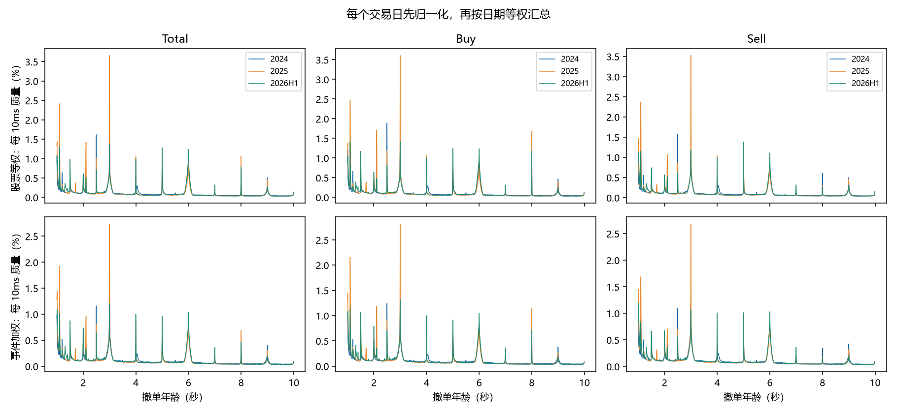
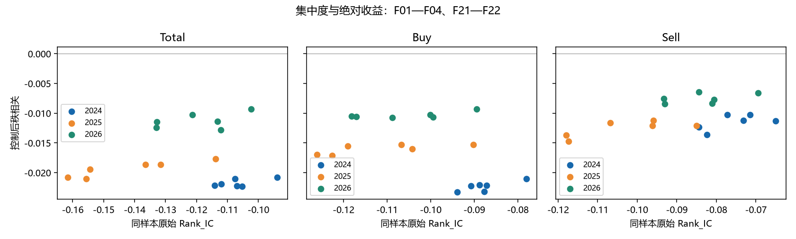
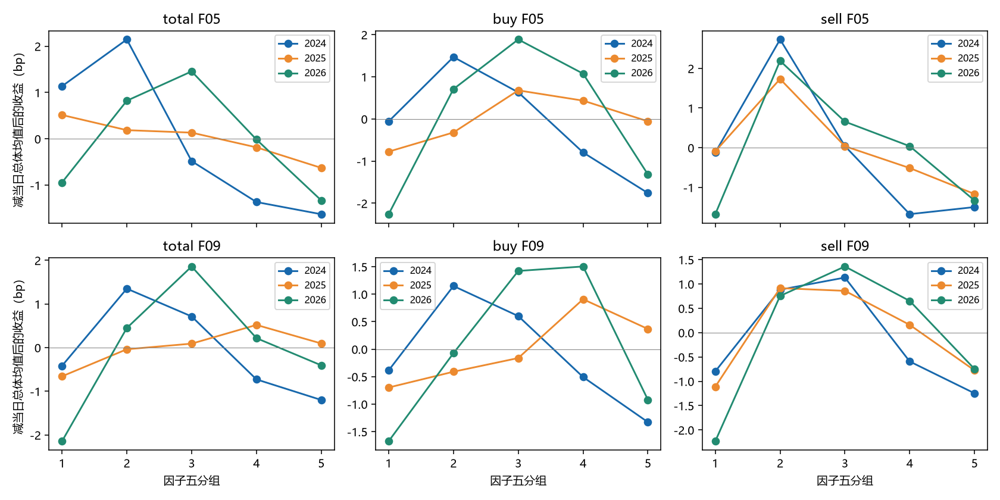
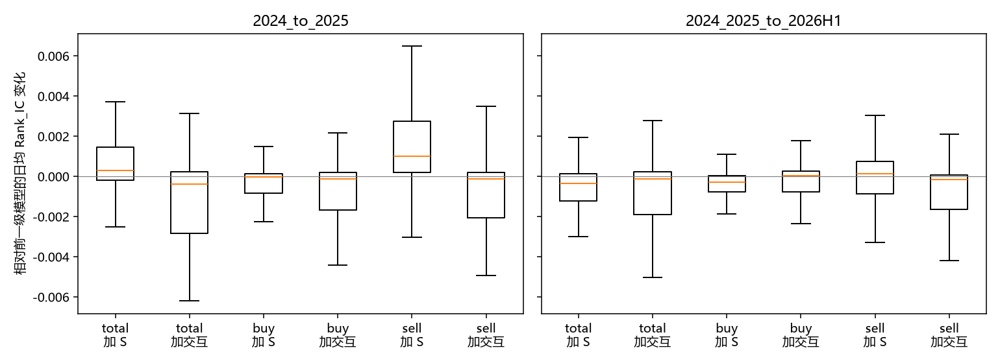

# 机械撤单全历史预检：测量结构、估计误差与条件收益

覆盖 2024-01-02 至 2026-06-30，共 601 日、1,719,612 个股票日。Total、Buy、Sell 各 24 个原因子均保留；每个方向另含固定锚点、年龄、相对强度和时段变化，共 106 个描述符。单日完整业务性能审核为 23.971386 秒；本报告讨论全历史研究结果，不声称每个历史交易日都低于 30 秒。

本轮支持继续研究机械撤单的**测量结构和条件幅度关系**。整秒年龄峰真实存在，CKA 与撤单相对强度高度相关，部分因子有非单调分组形状；控制市场状态后，许多幅度关系明显减弱。加入描述符及方向交互后的收益预测改善较小，且随方向和年份变化，现有证据不足以冻结一个稳定的新正式收益因子。

所有历史已被查看，以下时间划分属于历史诊断；没有未参与选择的样本外验证，也没有交易成本、组合构造或实盘收益结论。没有向其他账户同步或部署新交易策略。

## 口径、覆盖与复核

- 预测窗口为 `[09:30,09:35)`，撤单年龄 `[1s,10s)`，10ms 分箱；500/1000ms 周期、20/50ms 核尺度全部保留。
- 标签为 `ret_intraday_vwap_0944_0945_from_d1_0935_last`：同日 09:35 前最后成交价至 09:44—09:45 VWAP；`d1` 不表示隔日。
- 年度交易日分别为 242、243、116。跨日统计按日期等权；HAC 保留有效日期位置，提供滞后 1、5、10 日结果。2026 在附表中表示 2026H1。
- 同样本控制包含价格、五分钟 RV、log(1+订单数)、n/N、成交金额、价差、深度；秩亏和缺失样本保留状态，不补零。控制前后的比较使用相同完整案例。
- 601 日日包独立验收通过，包括 72 列基准、键和掩码、块与分母守恒、收益分解及 41,445 次显式订单副本参考比较。118 个复用日已完整纳入当前根目录，另 483 日为恢复运行产物。
- 独立重算 3,027,360 行因子期间汇总、61,056 行模型期间汇总，最大数值差约 `1.28e-15`。核验 5,088 组模型预处理参数，并对预先固定位置的 480 组模型独立最小二乘拟合，每组复核测试期首、中、末三个交易日；预测值一致，指标最大差 `1.11e-16`。这项参考拟合覆盖 480 组，不冒充 5,088 组全部重拟合。

相关证据：[日验收](day_acceptance.json)、[汇总复核](cross_day_verification.json)、[模型数值参考](model_numeric_reference.json)、[研究附表生成](research_collection.json)。报告与附图的文件哈希见 `report_bundle.json`；最终封存以运行根目录 `_SUCCESS`、`TRANSFER_MANIFEST.json` 和根目录外回验收据共同确认。

## 1. 固定锚点是否提供了原相位集中度之外的测量？

提供了不同的测量。股票等权和事件加权年龄分布都能看到整秒附近的峰，且不同锚点强度随年份变化。按 10ms 箱直接积分、取整秒左右各 20ms、并截于 `[1s,10s)`，Total 的整秒邻域质量在 2024、2025、2026H1 分别为 **14.74%、19.72%、16.79%**；半秒邻域分别为 **4.74%、3.84%、4.59%**。这里是原始概率质量，不能当作扣除背景后的“超额峰面积”。端点处只有窗口内箱，未向窗外补质量。

固定锚点面积与原 F01 并不等价。全期 Total 截面 Spearman 的日期均值中，F01 与 1s、1.5s、2s、3s 的 20ms 锚点面积分别为 **0.072、0.031、0.006、0.237**。F01 与早段、晚段整秒面积的相关分别为 **0.434、0.310**。原相位集中度反映折叠后的整体集中程度，固定年龄锚点还区分峰出现在哪个年龄，二者应并列保留。

结论：保留固定锚点作为机制定位工具；当前相关性差异不足以证明新增锚点有独立收益价值。全部锚点参数均按预注册计算，没有根据收益挑选最优年龄或宽度。[质量附表](age_mass_summary.csv)、[测量相关附表](descriptor_correlations_selected.csv)。

## 2. 1s 边界和年龄结构是否重要？

重要。Total 在 `[1.00s,1.10s)` 内的股票等权质量分别为 **3.86%、5.95%、5.76%**；1—3s 年龄份额分别为 **34.59%、41.77%、40.03%**。后者的上升伴随 6—10s 份额从 27.95% 降至 23.17%、再回到 25.04%。因此，跨年峰高变化不能全部解释为周期性增强，还混有撤单年龄分布变化。

1s 是入选年龄下界，图上边界附近的质量不能用双侧对称背景作未经验证的外推。后续构造应保留年龄份额和边界诊断，避免把年龄向短端迁移完全计入“机械性增强”。

年龄份额本身也没有稳定的收益方向。例如 Total 的 6—10s 份额与收益的控制后秩相关，在三年分别为 **0.0010、−0.0035、−0.0074**。它可作为解释变量或混杂控制候选，尚不支持固定正负号的收益评分。[年龄与时段均值](age_time_means.csv)、[全描述符同样本年度表](same_sample_annual.csv)。

## 3. 早晚段变化是否只是 09:35 截断造成？

本轮用相同可观察年龄比较早晚提交段，并排除无法在截止前完整观察 10 秒年龄的尾部订单；日验收检查相应时间和守恒条件。因此，下表中的变化已经按预注册消除最直接的观察窗口长度差异，仍只能解释为时段条件差异，不能据此识别交易者策略。

| Total 描述符，股票日均值再按日期等权 | 2024 | 2025 | 2026H1 |
|---|---:|---:|---:|
| 早段整秒面积 | 0.01198 | 0.01797 | 0.01560 |
| 晚段整秒面积 | 0.01211 | 0.01642 | 0.01316 |
| 配对的晚减早整秒变化 | 0.00014 | −0.00154 | −0.00244 |
| 配对的晚减早半秒变化 | 0.00120 | 0.00079 | 0.00157 |

变化项使用两段均有效的样本，不能要求“单独早段均值与晚段均值的差”精确等于“变化项均值”。Buy 的整秒变化为 −0.00048、−0.00300、−0.00374；Sell 为 −0.00015、−0.00110、−0.00135，方向存在差异。

这些结构未转化为稳定的收益关系：Total 整秒变化与收益的控制后秩相关为 **0.00004、−0.00032、−0.00263**，半秒变化为 **−0.00018、0.00071、0.00497**。结论是保留时段测量作机制研究，不冻结收益符号。

## 4. 哪些值更不稳定，能否直接删除低消息数股票？

不能根据消息数简单删除。下表是 Total F01、10 秒订单块、128 次复制、全期日期等权的实际估计。n 为合格撤单支持数；组别来自共同名次样本。标准误是描述符单位，迁移率是复制后离开原五分组的概率。

| 支持层 | 五分组 | 日均股票数 | 平均标准误 | 平均组别迁移率 |
|---|---:|---:|---:|---:|
| n<20 | G1 | 27.87 | 0.07545 | 70.12% |
| n<20 | G5 | 13.74 | 0.12920 | 20.39% |
| 20≤n<100 | G1 | 151.27 | 0.02659 | 52.58% |
| 20≤n<100 | G5 | 240.83 | 0.08739 | 28.98% |
| n≥100 | G1 | 373.46 | 0.00998 | 23.98% |
| n≥100 | G5 | 298.24 | 0.06678 | 36.33% |

同一支持层内，高值端的绝对标准误也可能更大；低支持高值端的组别迁移率却可能低于低值端。极端秩、组边界和数值尺度会共同影响这两个指标，不能将“留在 G5”解释为数值估计精确。n≥100 的中间 G2—G4 迁移率仍为 **53.41%、59.34%、56.33%**。

块长敏感性没有改变这个主要形状：n≥100 的 G1 标准误在 5/10/20 秒块下为 **0.00992/0.00998/0.01015**，G5 为 **0.06823/0.06678/0.06579**；G5 迁移率为 **36.88%/36.33%/35.80%**。完整附表包含所有支持层、五分组和三方向，`factor_group=-1` 保留未进入共同名次样本的股票，迁移率未知不补零。

结论：下一步若考虑可靠性处理，应分别检查数值误差、秩区间和覆盖影响；本轮不自动收缩、不按消息数截断股票池，也不把重复订单副本当作独立原订单。[支持度和敏感性表](support_selected.csv)、[支持覆盖](support_coverage.csv)。

## 5. 控制市场状态后还剩多少幅度关系？

幅度关系明显减弱，但并非全部消失。以下比较的是完全相同股票样本，避免将样本筛选效果误当控制效果。

| F01 方向 | 年份 | 同样本原始 Rank_IC：绝对收益 | 控制后秩相关 |
|---|---|---:|---:|
| Total | 2024 | −0.10533 | −0.02231 |
| Total | 2025 | −0.13158 | −0.01864 |
| Total | 2026H1 | −0.11329 | −0.01143 |
| Buy | 2024 | −0.08773 | −0.02316 |
| Buy | 2025 | −0.10425 | −0.01599 |
| Buy | 2026H1 | −0.10013 | −0.01026 |
| Sell | 2024 | −0.07317 | −0.01121 |
| Sell | 2025 | −0.09612 | −0.01214 |
| Sell | 2026H1 | −0.08065 | −0.00772 |

Total F21/F22 控制后的绝对收益关系也保持负号但减弱：F22 三年为 **−0.02195、−0.01949、−0.01242**。这说明主要关系与市场状态有很大重合；剩余相关仍是条件关联，不是因果或可交易收益证明。

CKA 需要单独解释。Total F13 与 n/N 的全期日均 Spearman 为 **0.81249**，F01 为 **0.17607**；将二者称作同一种纯集中度会掩盖分母定义的差异。F13 与绝对收益的同样本原始相关从 −0.05828 变为 0.00118、0.03777，控制后则为 −0.02599、−0.02327、−0.01173。该变化提示相对撤单强度及市场状态的混杂作用，支持继续保留 CKE、CKA 分开的解释与验收。

全 72 列三年结果均在[原因子年度表](original_72_annual.csv)，含收益、绝对收益、去当日均值后的绝对收益三个目标；F01—F24 的精确公式列名见[列字典](factor_dictionary.csv)。普通/跨订单对应列按原合同保留，近乎相同的结果不重复计为独立发现。

## 6. 非单调关系、方向差异是否保留？

保留。下表为 Total 的组均值，单位 bp，尚未减当日总体均值，用于展示原始曲线；图中使用减去当日总体均值后的收益，减少不同年份整体收益水平的干扰。

| 因子 | 年份 | G1 | G2 | G3 | G4 | G5 |
|---|---|---:|---:|---:|---:|---:|
| F05 | 2024 | 0.26 | 1.27 | −1.35 | −2.24 | −2.50 |
| F05 | 2025 | 6.18 | 5.85 | 5.80 | 5.48 | 5.04 |
| F05 | 2026H1 | −1.95 | −0.18 | 0.45 | −1.02 | −2.33 |
| F09 | 2024 | −1.29 | 0.48 | −0.16 | −1.60 | −2.07 |
| F09 | 2025 | 5.01 | 5.63 | 5.76 | 6.19 | 5.76 |
| F09 | 2026H1 | −3.15 | −0.56 | 0.85 | −0.79 | −1.41 |

中间组较高的形状在部分年份存在，但最高组位置和单调性并不固定。只用线性 IC 会漏掉部分结构；反过来，也不能从一年的中间峰推出固定的倒 U 型评分。三方向同时保留，Total 的合并事件统计不由 Buy/Sell 均值替代。

完整条件分组包含价格方向、成交不平衡三分组、RV 三分组、活动量三分组，以及上涨概率、条件上涨/下跌幅度、组内标准差和均值的日级拆解。均值恒等式已逐日验证，跨日均值与其组成部分的乘积不要求相等。报告的[条件分组附表](selected_conditional_groups.csv)保留六个代表族的全部上述条件及 HAC(5)，全 106 描述符、全部 HAC 口径位于服务器 `output/period_summary.parquet`。

## 7. 描述符和方向交互是否改善历史模型？

模型使用 2024 训练→2025 评价、2024—2025 训练→2026H1 评价。每次只有一个描述符 S；方向状态 D 分别取前五分钟收益与成交不平衡。比较 `X`、`S`、`X+S`、`X+S+S*D`，所有模型使用同一完整案例，中心、尺度与形状折点只由训练区间估计。

下表为每个方向 106 描述符×2 个方向状态的**日均预测 Rank_IC 增量的中位数**，不是最佳模型。完整最小值、最大值和每个模型值均已保留。

| 评价区间 | 方向 | 加 S：X+S 减 X | 加交互：X+S+S*D 减 X+S |
|---|---|---:|---:|
| 2025 | Total | 0.000289 | −0.000396 |
| 2025 | Buy | −0.000041 | −0.000130 |
| 2025 | Sell | 0.000986 | −0.000131 |
| 2026H1 | Total | −0.000355 | −0.000121 |
| 2026H1 | Buy | −0.000284 | 0.000022 |
| 2026H1 | Sell | 0.000126 | −0.000171 |

个别组合有正增量，例如 Sell 加 S 的最大增量在 2025 为 0.01438，在 2026H1 为 0.00645；这些是同一表内事后观察到的最大值，不据此挑选正式版本。增量的中位数较小，交互项多数中位数为负；目前不支持“加入机械撤单必然改善收益预测”。单个模型均值的 HAC 不能直接当作两个模型差值的标准误，本报告不据这些增量声称统计显著。

共同样本损失不可忽略：2025 每日平均保留约 **1,689—1,690** 只股票、损失约 **41.0%—41.1%**；2026H1 保留约 **1,902—1,903** 只、损失约 **34.1%**。这里按全部描述符模型平均，具体描述符覆盖可从原 `model_daily.parquet` 逐日追踪。条件模型结果不代表全部股票池的等覆盖预测。

[全模型比较](model_comparison.csv)、[逐模型增量](model_rank_ic_deltas.csv)、[覆盖](model_coverage.csv)。

## 8. 本轮预检判断与下一步边界

| 内容 | 本轮判断 | 依据与后续用途 |
|---|---|---|
| 原 72 列 | 完成验收并全部保留 | 重复版本不作为独立发现；不用 F22 代替全族。 |
| 固定锚点、年龄份额 | 保留研究 | 峰位置和年龄分布有清晰结构；与原集中度不等价，尚无稳定增量收益证明。 |
| 早晚段和变化项 | 保留机制诊断 | 同可观察年龄下仍有差异；收益关系跨年变化，不固定收益符号。 |
| 重采样可靠性 | 暂不自动调整因子 | 数值误差和组别迁移率不等价；低/中/高值均需核对，不能只删低消息数。 |
| CKE 与 CKA | 分开解释 | CKA 与 n/N 高度相关，分母所含信息不能忽略。 |
| 非单调分组 | 保留形状诊断 | 不同年度和方向峰形不同，不能只看 IC，也不能立即冻结倒 U 形评分。 |
| 方向交互模型 | 未达到冻结新收益因子的证据要求 | 平均增量小、跨期不稳定、共同样本损失较大，且历史已参与查看。 |

本轮任务到历史预检、真实结论和结果封存为止。新正式因子构造、可靠性收缩、扩展事件配对链和交易验证均不在本轮执行范围内。

## 结果位置与复现

运行根目录为：

`/home/wangly/hdd-store/outputs/sirui/published/mechanical-cancel-prescreen/history-20240102-20260630-5c17a7db6b54-20260910T031937Z`

完整日包物理位置见 `acceptance/day_inventory.json`，其中 118 日位于 `reused_days/`，483 日位于 `output/runs/`。全部 601 日支持度、相关性、年龄测量的年度结果位于 `review/`；本报告附表是可浏览的摘要，完整逐日/逐描述符结果继续保留。

| 部分 | 精确版本 |
|---|---|
| 恢复运行业务 | `5c17a7db6b54f008f6c1b3299c38e829b0788167` |
| 118 日业务来源 | `8e448a69d12ca0e4b23b2dba27903c70b5bdd8df` |
| 独立日验收 | `06e9389e680cd9512770f76b49fc3adecb005452` |
| 汇总复核 | `8ff7e250f9f6040414edc6f551533040b14f93e3` |
| 模型数值参考 | `294a0409a17c06e75f15dc3e8700096b8e951bf4` |
| 研究附表汇总 | `90f4854f39695d8792c2d09382f1c54212edb4ea` |

合同哈希：`d022b28474b95de933bd94cafe61dccf6d550a54323a890fa177ed956c79b172`。
日期哈希：`5b7b857b111e9de1774f6cef99e2bf55686abe8e9bcd9d981178d4ef4dacb1e1`。

复现研究附表使用 `collect_cancel_phase_history_research.py`；本地图表使用 `render_cancel_phase_history_evidence.py --evidence <review数据目录> --output <报告目录>`。已封存目录不可作为重跑输出目录。
