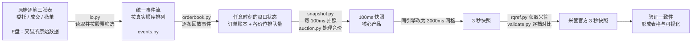

# LV2 逐笔数据重建 100ms 快照：项目总结

本文依据的项目目录为 `D:\MG\！Internship\26 Summer\❗思瑞投资\lv2_snapshot_workspace`，完整讲解 Notebook 为 `D:\MG\_GitLinked\Quant_Research-Trading\26 Summer\❗思瑞投资\lv2_snapshot_workspace\notebooks\00_项目全流程讲解.ipynb`。

## 一、成果

本项目完成了一条可复现、可验证的 LV2 订单簿重建流水线：

- 输入：交易所逐笔委托、逐笔成交、逐笔撤单三张 Parquet 表。
- 核心：把三类事件合并成统一事件流，维护“订单账本 + 买卖各价位聚合量”的状态机。
- 输出：100ms 快照、3 秒快照、全深度盘口、买卖五档宽表及统计字段。
- 特殊处理：开盘/收盘集合竞价、市价单与本方最优单、上海主动单缺少独立委托记录等交易所差异。
- 正确性证明：深圳 `000001`（平安银行）和上海 `600000`（浦发银行），各 7 个交易日；“我的 3s vs 我的 100ms”完全一致，且连续交易时段按累计成交量对齐米筐后，买卖五档逐档命中率均为 **100%**。

## 二、任务是什么：把“流水账”还原成“盘口”

交易所给出的 Level 2 数据是一条条事件：谁在什么时间、以什么价格挂了多少买单或卖单，哪些订单成交了，哪些订单撤回了。
“盘口”指某一瞬间市场上各个价格的待成交买量和卖量。

本项目的目标形式化为：

- 输入：按真实先后顺序排列的委托、成交和撤单事件；
- 状态：每个未完成订单的方向、价格和剩余量，以及买卖两侧各价格的总排队量；
- 输出：每隔 0.1 秒记录一次当前状态，形成 100ms 订单簿快照。

## 三、全流程



对应的核心代码位于原项目 `src/snapshot/`：

`io.py → events.py → orderbook.py → snapshot.py / auction.py → rqref.py → validate.py`

## 四、原始数据与真值数据

### 4.1 交易所逐笔数据

原始数据位于：

`E:/rql2_tick_20240102_20260622/data/parquet_by_day/`

每个交易日一个文件夹，其中有三张表：

| 文件 | 中文含义 | 一行代表什么 | 关键字段 |
|---|---|---|---|
| `order.parquet` | 逐笔委托 | 新增一个买单或卖单，例如“9.40 元买 100 股” | 价格、数量、方向、订单号 |
| `trade.parquet` | 逐笔成交 | 一个买单与一个卖单发生配对成交 | 成交价、成交量、买方订单号、卖方订单号 |
| `cancel.parquet` | 逐笔撤单 | 撤回此前挂出订单的全部或部分剩余量 | 撤单量、订单号 |

全市场一天三张表合计约 **2.3 亿行**。因此读取层不能一次性把整日全市场数据装入内存，而是使用 Parquet 的列裁剪和股票代码过滤，只读取某天、某只股票所需的列与行。单个文件可能达到约 1.7GB，按需读取对性能和内存都很重要。

原始时间字段为 `data_time`，是毫秒级交易所时间，存储为 UTC；在标准化事件时转换为北京时间（`Asia/Shanghai`）。

对应代码：

- `src/snapshot/io.py`：读取 Parquet，并按日期、股票筛选；
- `src/snapshot/rqref.py`：获取并缓存米筐参考数据。

### 4.2 米筐官方快照

米筐（RiceQuant）环境位于 `D:/MG/rq`，通过 `rqdatac` 联网获取某股票、某交易日的官方快照，并缓存到 `outputs/ref/`，避免重复联网。

米筐数据是每约 **3 秒**一张、买卖各 **5 档**的盘口快照。它是本项目的外部参考真值，但最高频率只有 3 秒，没有 100ms 真值。因此：

- 100ms 快照由本项目自行重建；
- 只能在可对齐的 3 秒或同一累计成交量状态上与米筐核验；
- 不能把“没有 100ms 官方参考”误解为“100ms 无法验证”，因为 100ms 与 3s 使用的是同一状态机，只是拍照网格不同。

## 五、核心算法：逐条回放重建订单簿

### 5.1 三张表合并为统一事件流

`src/snapshot/events.py` 把委托、成交、撤单标准化为共同字段，再合并和排序。主要字段包括：

- `evtype`：`order`、`trade` 或 `cancel`；
- `seq`：交易所原始事件序号；
- `channel_no`：频道号；
- `ts`：转换后的北京时间；
- `qty`、`price_i`、`side`、`order_id`、`ord_type`；
- `bid_id`、`ask_id`：成交引用的买卖双方订单号。

项目对样本数据做过验证：同一只股票内，三张表的 `seq` 可以共同刻画真实发生顺序，连续且不重复。实现中进一步按 `channel_no, seq` 稳定排序；可以理解为“频道是事件通道，`seq` 是通道中的时间顺序”。这一步是整个项目的前提：顺序一旦错位，撤单可能发生在委托之前，成交也可能扣错订单，后续所有快照都会失真。

价格不使用浮点数长期计算，而是采用 `price_scale=10000` 转为整数，例如：

`9.40 元 → 94000`

这样可以避免浮点误差造成同一价位被错误拆成多个键。

### 5.2 订单簿状态机

`src/snapshot/orderbook.py` 是项目的核心。状态机持续维护三类状态：

1. 订单账本：`订单号 → 方向、价格、剩余量、是否真实挂在盘口中`；
2. 买盘聚合表：`价格 → 当前买方总排队量`；
3. 卖盘聚合表：`价格 → 当前卖方总排队量`。

三类事件的更新规则如下：

| 事件 | 状态更新 |
|---|---|
| 委托 | 在订单账本中新建订单；普通限价单还要把数量加到对应方向、对应价位 |
| 成交 | 根据 `bid_id`、`ask_id` 找到两边订单，分别扣减剩余量，并同步扣减其价位聚合量 |
| 撤单 | 根据 `order_id` 找到原订单，扣减订单剩余量和对应价位聚合量 |

用一个极简例子理解：

1. A 挂 `9.40 买 100`，则买盘 9.40 从 0 变成 100；
2. B 挂 `9.41 卖 60`，则卖盘 9.41 从 0 变成 60；
3. A 撤回 20，买盘 9.40 变成 80；
4. A 的订单成交 50，买盘 9.40 只剩 30。

只要严格按事件顺序更新，任何时刻的盘口都是此前全部事件作用后的唯一状态。

### 5.3 两个关键边界问题

**问题一：市价单和“本方最优”单。**

这类订单的价格可能是 0，或者其实际价格要在进入市场时根据盘口决定。如果把它们当普通限价单直接挂入盘口，可能出现“0 元卖一”等明显错误。因此项目不会把这类订单直接作为固定价位的 resting order 放进盘口，而是在成交和集合竞价逻辑中按其真实语义处理。

**问题二：上海主动单可能没有独立委托记录。**

上海市场中，一来就立即全部成交、未在盘口停留过的主动单，可能不单独发送委托记录。于是成交事件会引用一个订单账本中不存在的订单号。这是交易所数据口径造成的正常情况，不是数据丢失，也不需要从盘口扣减一个本来就没有挂过的订单。上海任务需要使用 `strict=False`，CLI 中对应 `--non-strict`；深圳没有这一现象。

## 六、从连续状态生成 100ms 快照

### 6.1 交易时间网格

`src/snapshot/sessions.py` 定义 A 股交易阶段：

| 阶段 | 时间 |
|---|---|
| 开盘集合竞价 | 09:15–09:25 |
| 上午连续交易 | 09:30–11:30 |
| 下午连续交易 | 13:00–14:57 |
| 收盘集合竞价 | 14:57–15:00 |

实现会在有效交易时段内以 100ms 为间隔生成网格点：09:25 和 15:00 撮合点单独保留，中午休市等空档不生成快照。

`src/snapshot/snapshot.py` 对每个网格时刻 `t` 做两件事：

1. 消费全部满足 `event_time <= t` 的事件；
2. 把事件消费后的订单簿状态写成快照。

这种语义很重要：时间点 `t` 的快照包含 `t` 时刻已经发生的事件，而不包含 `t` 之后的事件。

### 6.2 集合竞价不能照搬连续竞价

连续交易中，买卖订单实时撮合；集合竞价中，订单先积累，到 09:25 或 15:00 再统一确定价格和成交量。因此 `src/snapshot/auction.py` 单独模拟指示性集合竞价结果，即“如果现在立刻撮合，虚拟成交价、可成交量和未平衡量分别是多少”。

候选价来自当前买卖盘出现过的价格；对每个候选价 `p`：

- 需求量 = 市价买单 + 所有价格不低于 `p` 的限价买量；
- 供给量 = 市价卖单 + 所有价格不高于 `p` 的限价卖量；
- 可成交量 = `min(需求量, 供给量)`；
- 不平衡量 = `需求量 - 供给量`。

择价规则依次为：

1. 可成交量最大；
2. 买卖不平衡量绝对值最小；
3. 离参考价最近；
4. 若仍相同，选择更高价格。

若买卖盘没有可成交重叠，即 `matched_vol == 0`，项目输出 `(0, 0, 0)`，与交易所/米筐口径一致，而不是硬给一个没有实际意义的虚拟价格。

## 七、为什么还生成 3 秒快照

米筐只有约 3 秒频率。为了处在同一频率上逐档比较，项目复用同一个重建引擎，仅把拍照网格从 `100ms` 改为 `3000ms`，额外生成 3 秒快照。

因此可以同时观察：

- 我的 100ms：最细粒度结果；
- 我的 3s：同一引擎的低频输出，也可视为 100ms 的公共网格取样；
- 米筐 3s：外部参考。

在公共时点三者重合，能同时说明“我的 3s 与官方一致”以及“我的 100ms 在公共点与 3s 自洽”。三方比较由 `src/snapshot/cli.py` 的 `compare3` 命令执行，结果写到 `outputs/reports/threeway/`。

## 八、验证体系：怎样证明“做对了”

项目没有只看一张图，而是设计了三条互相补充的校验。

### 8.1 校验 C1：我的 3s = 我的 100ms 在 3 秒点上的取样

二者使用完全相同的状态机和规则，仅拍照频率不同。因此公共 3 秒点上的全部字段必须完全相等。

结果：`c1_exact_rate = 1.0`，逐字段完全相等，`c1_mismatch_count = 0`。这证明 3 秒与 100ms 输出自洽，没有因网格切换引入额外错误。

### 8.2 权威校验：按累计成交量对齐米筐

这是判断订单簿是否还原正确的最重要标准。米筐某张快照若显示累计成交量为 `V`，就从本项目的事件回放过程中找到累计成交量同为 `V` 的状态，再逐档比较买卖五档。

累计成交量单调不减，比存在打标偏移的墙钟时间更适合作为状态键。结果是：沪深各 7 天，连续交易时段前五档逐档命中率全部为 **100%**。

### 8.3 诊断校验：按米筐时间标签直接对齐

直接把米筐快照标注的时间与本项目网格对齐，深圳约为 0.95、上海约为 0.9。这个指标较低并不表示盘口重建错误，而是米筐时间标签与实际状态时刻存在偏移：

- 深圳标签基本落在整秒，但内容通常对应其后约 0.1–1 秒的状态；
- 上海时间戳本身常带约 0.7 秒的亚秒偏移，例如 `09:15:00.747`；
- 上海对比实现使用 1600ms 对称窗口内的最近网格点，只用于诊断，字段相等标准没有放宽。

因此最终汇报把 `c2_wallclock_match_rate` 明确标为诊断列，并以成交量对齐结果作为正确性依据。

### 8.4 米筐时间戳证据（2024-01-02）

| 证据点 | 深圳 `000001` | 上海 `600000` | 说明 |
|---|---:|---:|---|
| 米筐首条时间戳 | `09:15:00` | `09:15:00.747000` | 上海自带约 0.7 秒零头 |
| 米筐末条时间戳 | `15:00:00` | `15:00:03.746000` | 上海快照时间标签并非整 3 秒网格 |
| 行数 | 4828 | 4513 | 当日缓存快照行数 |
| 毫秒分布 Top 5 | `{0: 4828}` | `{746: 206, 743: 198, 744: 193, 749: 182, 745: 172}` | 深圳为整秒；上海集中在 743–749ms |
| 间隔分布 Top 5 | `{3.0: 4742, 9.0: 80, 18.0: 3, 300.0: 1, 5400.0: 1}` | `{2.998: 114, 3.0: 109, 3.002: 107, 2.999: 107, 3.001: 103}` | 米筐是约 3 秒快照，不是 100ms 真值 |
| 墙钟对齐命中率 | `0.954167` | `0.940285` | 受时间标签偏移影响 |
| 墙钟差异行数 | `5959` | `7243` | 仅作诊断 |
| 成交量对齐命中率 | `4743/4743 = 1.0` | `4402/4402 = 1.0` | 同一累计成交量下，连续竞价前五档全部对上 |

结论：米筐时间戳可以帮助诊断，但不能作为唯一对齐标准；最终正确性应看同一累计成交量下盘口是否一致。

## 九、沪深市场差异与兼容方案

项目选择了两只低价、活跃的银行股：

- 深圳：`000001` 平安银行，代码以 0/3 开头，米筐后缀 `.XSHE`；
- 上海：`600000` 浦发银行，代码以 6 开头，米筐后缀 `.XSHG`。

| 差异 | 深圳 | 上海 | 项目处理 |
|---|---|---|---|
| `order_id` 是否等于 `seq` | 相等 | 不相等 | 排序使用事件序号，订单查找使用订单号，职责分开 |
| 即时成交主动单 | 通常有委托记录 | 可能没有独立委托记录 | 上海以 `--non-strict` 跳过不存在于账本的主动单引用 |
| 米筐时间戳 | 基本为整秒 | 常带约 0.7 秒零头 | 墙钟诊断使用窗口内最近点，权威校验使用累计成交量 |

这些市场差异均没有改变最终结论：两市各 7 天的连续交易盘口按成交量对齐均为 100%。

## 十、工程文件地图

| 文件 | 职责 |
|---|---|
| `src/snapshot/io.py` | 读取 E 盘逐笔 Parquet，按股票和日期筛选所需数据 |
| `src/snapshot/events.py` | 三张表标准化为统一事件流；按 `channel_no, seq` 排序；价格转整数 |
| `src/snapshot/orderbook.py` | 核心状态机：维护订单账本与买卖盘口 |
| `src/snapshot/auction.py` | 集合竞价集中定价，生成虚拟价格、可成交量和不平衡量 |
| `src/snapshot/sessions.py` | 定义交易阶段、100ms/3s 时间网格及阶段判断 |
| `src/snapshot/snapshot.py` | 在每个网格点记录全深度、五档宽表及统计字段 |
| `src/snapshot/rqref.py` | 获取并缓存米筐官方 3 秒快照 |
| `src/snapshot/validate.py` | C1、成交量对齐、墙钟诊断和三方对比 |
| `src/snapshot/cli.py` | CLI 入口：`build-day`、`compare3`、`eventwise-ref`、`render-sz-sh` 等 |
| `tests/test_orderbook.py` | 单元测试与防回归测试，包括故意造错、确认校验必须能抓到 |
| `notebooks/` | 分阶段展示和验证报告，`00_项目全流程讲解.ipynb` 为总讲解 |
| `outputs/` | 快照 Parquet、米筐缓存、差异报告、汇总表与图片 |
| `PLAN.md` | 第一阶段计划 |
| `PLAN_02_3s_and_threeway.md` | 3 秒快照与三方验证计划 |
| `PLAN_03_shanghai_stock.md` | 上海样本扩展计划 |
| `FIX_PLAN_01_validation.md` | 校验缺陷修复计划 |
| `FIX_PLAN_02_sse_c2_and_auction.md` | 上海墙钟诊断与竞价修复计划 |
| `FIX_PLAN_03_overlay_viz.md` | 三方重合图优化计划 |

## 十一、运行方式

所有操作统一通过 `python -m snapshot.cli <子命令>`。以上海 `600000`、`2024-01-02` 为例：

```bash
# 1) 获取米筐官方 3 秒快照，缓存到 outputs/ref/
python -m snapshot.cli cache-ref     --code 600000 --date 2024-01-02

# 2) 生成 100ms 快照；上海需要 --non-strict
python -m snapshot.cli build-day     --code 600000 --date 2024-01-02 --grid-ms 100  --non-strict

# 3) 生成 3 秒快照
python -m snapshot.cli build-day     --code 600000 --date 2024-01-02 --grid-ms 3000 --non-strict

# 4) 三方比较：我的 100ms / 我的 3s / 米筐 3s
python -m snapshot.cli compare3      --code 600000 --date 2024-01-02

# 5) 权威校验：按累计成交量对齐
python -m snapshot.cli eventwise-ref --code 600000 --date 2024-01-02

# 6) 汇总为沪深对照表
python -m snapshot.cli render-sz-sh
```

原 README 的环境示例使用：

```powershell
D:\MG\rq\python.exe -m pip install -e .[dev]
D:\MG\rq\python.exe -m snapshot.cli --help
D:\MG\rq\python.exe -m pytest
```

## 十二、验证结果

### 12.1 沪深 × 7 个交易日汇总

| 市场 | 股票 | 日期 | C1 精确率 | 连续段成交量对齐 | 集合竞价命中率 | Crossed book 数 | 墙钟诊断命中率 |
|---|---:|---|---:|---:|---:|---:|---:|
| SSE | 600000 | 2024-01-02 | 1.0 | 1.0 | 1.000000 | 2 | 0.940285 |
| SSE | 600000 | 2024-01-03 | 1.0 | 1.0 | 1.000000 | 2 | 0.940902 |
| SSE | 600000 | 2024-01-04 | 1.0 | 1.0 | 1.000000 | 1 | 0.920880 |
| SSE | 600000 | 2024-01-05 | 1.0 | 1.0 | 0.988235 | 2 | 0.927479 |
| SSE | 600000 | 2024-01-08 | 1.0 | 1.0 | 0.986667 | 2 | 0.879543 |
| SSE | 600000 | 2024-01-09 | 1.0 | 1.0 | 1.000000 | 2 | 0.870923 |
| SSE | 600000 | 2024-01-10 | 1.0 | 1.0 | 0.990000 | 2 | 0.887598 |
| SZSE | 000001 | 2024-01-02 | 1.0 | 1.0 | 1.000000 | 0 | 0.954167 |
| SZSE | 000001 | 2024-01-03 | 1.0 | 1.0 | 1.000000 | 0 | 0.963900 |
| SZSE | 000001 | 2024-01-04 | 1.0 | 1.0 | 1.000000 | 0 | 0.955241 |
| SZSE | 000001 | 2024-01-05 | 1.0 | 1.0 | 1.000000 | 0 | 0.933722 |
| SZSE | 000001 | 2024-01-08 | 1.0 | 1.0 | 0.988506 | 0 | 0.954469 |
| SZSE | 000001 | 2024-01-09 | 1.0 | 1.0 | 0.987179 | 0 | 0.963814 |
| SZSE | 000001 | 2024-01-10 | 1.0 | 1.0 | 1.000000 | 0 | 0.967751 |
| **SSE 7 日汇总/均值** | **600000** | — | **1.0** | **1.0** | **0.994986** | **13** | **0.909658** |
| **SZSE 7 日汇总/均值** | **000001** | — | **1.0** | **1.0** | **0.996526** | **0** | **0.956152** |

`c1_mismatch_count` 在 14 个每日样本中全部为 0。两只股票 7 日累计成交笔数分别为：上海 `146,163`，深圳 `352,858`。

可下载原始汇总：[summary_sz_vs_sh.csv](assets/lv2_snapshot/summary_sz_vs_sh.csv)。


### 12.2 深圳三方重合图

图中同时展示我的 100ms 细线、我的 3 秒点和米筐 3 秒点。公共状态上的点完全重合；放大后还能看到 100ms 捕捉到的、3 秒采样会漏掉的盘中细节。


### 12.3 上海三方重合图


### 12.4 逐行三方并排表

选取若干时点，把“我的 100ms / 我的 3s / 米筐 3s”的买一卖一价量、最新价和累计量并排展示，可以逐行看到三方一致。


## 十三、走过的弯路与工程改进

### 13.1 第一版校验出现“假一致”

第一版验证逻辑存在隐蔽 bug：合并后的列名发生冲突，导致盘口字段实际上没有被正确比较，却输出了“无差异”。后来重写了校验逻辑，并增加防回归测试：故意修改盘口值，验证器必须报告差异。这个教训很重要——验证代码本身也需要被验证，不能因为报告显示 100% 就默认它正确。

### 13.2 按阶段迭代补齐能力

在核心重建完成后，项目依次补上：

1. 3 秒快照和三方对比；
2. 深圳、上海各 7 个交易日；
3. 修复上海墙钟诊断列显示 0.0 的误导；
4. 修复集合竞价首刻编码；
5. 优化重合图，使 100ms 细节和 3 秒点同时可见。

### 13.3 收盘竞价首刻的米筐空占位

部分日期在收盘集合竞价首刻 `14:57:00` 附近，米筐给出空占位 `(0,0,0)`，而项目根据当时真实订单簿仍能看到交叉状态。这不是连续交易重建错误，也不是成交量对齐错误，而是参考数据在边界时刻的编码差异。

实际异常清单共有 5 条：深圳 2024-01-08、2024-01-09；上海 2024-01-05、2024-01-08、2024-01-10。它们都被如实记录在 [auction_boundary_misses.csv](assets/lv2_snapshot/auction_boundary_misses.csv)，没有为了追求表面 100% 而隐藏。

另外，上海 7 日中出现的少量 `continuous_crossed_book` 计数集中于 09:25 或 15:00 附近的阶段边界网格点，不是连续交易逐档不一致；权威的成交量对齐指标仍为 100%。

## 十四、最终结论

1. 项目成功把 LV2 委托、成交、撤单流水还原为每 100ms 一张的订单簿快照。
2. 同一引擎生成的 100ms 与 3s 快照，在公共 3 秒点逐字段完全相等。
3. 深圳 `000001` 和上海 `600000` 各 7 个交易日，在同一累计成交量下与米筐连续交易买卖五档逐档 **100% 一致**。
4. 墙钟对齐分数较低来自米筐时间标签偏移，只作为诊断指标，不影响订单簿正确性结论。
5. 集合竞价边界的少量差异已定位为米筐空占位，并完整留痕；没有把参考数据口径差异误报为引擎错误。
6. 最终交付物包括 100ms/3s Parquet 快照、米筐缓存、差异报告、沪深 7 日汇总表、三方重合图和逐行并排表。

---

## 附录 A：Notebook 中的时间戳证据复现代码

以下代码完整保留自 `00_项目全流程讲解.ipynb`：

```python
from pathlib import Path
import pandas as pd

ROOT = Path.cwd().parent if Path.cwd().name == "notebooks" else Path("lv2_snapshot_workspace")

def ref_timestamp_profile(code: str, date: str = "2024-01-02") -> dict:
    ref = pd.read_parquet(ROOT / "outputs" / "ref" / f"{code}_{date}.parquet", columns=["dt", "volume"])
    dt = pd.to_datetime(ref["dt"])
    ms_counts = dt.dt.microsecond.floordiv(1000).value_counts().head(5).to_dict()
    gaps = dt.diff().dropna().dt.total_seconds().round(3).value_counts().head(5).to_dict()
    return {
        "code": code,
        "rows": len(ref),
        "first_dt": str(dt.iloc[0]),
        "last_dt": str(dt.iloc[-1]),
        "sample_first_3": " | ".join(str(x) for x in dt.head(3).tolist()),
        "top_ms": ms_counts,
        "top_gap_s": gaps,
    }

def validation_profile(code: str, date: str = "2024-01-02") -> dict:
    threeway = pd.read_csv(
        ROOT / "outputs" / "reports" / "threeway" / f"code={code}" / f"date={date}" / "summary.csv",
        dtype={"code": str, "date": str},
    ).iloc[0]
    eventwise = pd.read_csv(
        ROOT / "outputs" / "reports" / "eventwise" / f"code={code}" / f"date={date}" / "summary.csv",
        dtype={"code": str, "date": str},
    ).iloc[0]
    return {
        "code": code,
        "c1_100ms_vs_3s": threeway["c1_exact_rate"],
        "wallclock_rate": threeway["c2_wallclock_match_rate"],
        "wallclock_diff_rows": int(threeway["c2_diff_rows"]),
        "volume_keyed_rate": eventwise["volume_keyed_cont_hit_rate"],
        "volume_keyed_matched": f"{int(eventwise['volume_keyed_cont_matched'])}/{int(eventwise['volume_keyed_cont_total'])}",
    }

timestamp_evidence = pd.DataFrame([ref_timestamp_profile("000001"), ref_timestamp_profile("600000")])
validation_evidence = pd.DataFrame([validation_profile("000001"), validation_profile("600000")])

print("米筐缓存快照的时间戳证据：")
print(timestamp_evidence.to_string(index=False))
print("\n同一天验证结果对比：")
print(validation_evidence.to_string(index=False))
```

其输出的完整数值已经整理在本文 8.4 节；Notebook 原始首三条时间戳为：

- 深圳：`2024-01-02 09:15:00 | 2024-01-02 09:15:09 | 2024-01-02 09:15:27`；
- 上海：`2024-01-02 09:15:00.747000 | 2024-01-02 09:15:03.799000 | 2024-01-02 09:15:06.786000`。

## 附录 B：Notebook 中的结果展示代码

以下代码完整保留原 Notebook 读取汇总与展示图片的方式：

```python
# 读出沪深对照汇总表
from pathlib import Path
import pandas as pd
from IPython.display import Image, display

WS = Path.cwd()
if WS.name == 'notebooks':
    WS = WS.parent

summary = pd.read_csv(WS / 'outputs' / 'reports' / 'summary_sz_vs_sh.csv')
key_cols = [c for c in ['exchange','code','date','c1_exact_rate',
                        'cont_volume_keyed_hit_rate','auction_hit_rate',
                        'crossed_book_count','c2_wallclock_match_rate'] if c in summary.columns]
print("沪深 x 7天 验证汇总（头三列是权威指标）：")
display(summary[key_cols])
print("\n核心结论：c1_exact_rate 与 cont_volume_keyed_hit_rate 全部 = 1.0 (100%)")
print("即：我的3s≡我的100ms，且连续段逐档 100% 对齐米筐官方数据。")

# 成品图 1：沪深对照汇总表（图片版）
p = WS / 'outputs' / 'reports' / 'summary_sz_vs_sh.png'
display(Image(filename=str(p))) if p.exists() else print('未找到', p)

# 成品图 2：深圳 000001 三方重合图（100ms线 / 我的3s点 / 米筐3s点）
p = WS / 'outputs' / 'reports' / 'threeway' / 'code=000001' / 'date=2024-01-02' / 'threeway_overlay.png'
display(Image(filename=str(p))) if p.exists() else print('未找到', p)

# 成品图 3：上海 600000 三方重合图
p = WS / 'outputs' / 'reports' / 'threeway' / 'code=600000' / 'date=2024-01-02' / 'threeway_overlay.png'
display(Image(filename=str(p))) if p.exists() else print('未找到', p)

# 成品图 4：逐行三方并排表（某些时点价/量三方完全一致）
p = WS / 'outputs' / 'reports' / 'threeway' / 'code=000001' / 'date=2024-01-02' / 'threeway_table.png'
display(Image(filename=str(p))) if p.exists() else print('未找到', p)
```

Notebook 对上述汇总的原始打印结论是：

```text
核心结论：c1_exact_rate 与 cont_volume_keyed_hit_rate 全部 = 1.0 (100%)
即：我的3s≡我的100ms，且连续段逐档 100% 对齐米筐官方数据。
```

## 附录 C：Notebook 内容覆盖索引

| Notebook 单元 | 原内容 | 本文位置 |
|---:|---|---|
| 0–1 | 项目标题、任务、盘口解释、全流程、最终结论 | 一、二、三 |
| 2–3 | 原始逐笔、米筐数据、`io.py`、`rqref.py` | 四 |
| 4–5 | 输入/状态/输出、事件合并、订单簿状态机、两类边界问题 | 五 |
| 6 | 时间网格与集合竞价 | 六 |
| 7–9 | 三条校验与米筐时间戳证据、代码和输出 | 八、附录 A |
| 10 | 单独生成 3 秒快照与三方关系 | 七 |
| 11 | 沪深样本和市场差异 | 九 |
| 12 | 工程文件地图和阶段计划 | 十 |
| 13 | CLI 运行命令 | 十一 |
| 14 | 校验 bug、阶段修复、竞价首刻差异 | 十三 |
| 15–21 | 14 日汇总、4 张成品图、结论与展示代码 | 十二、十五、附录 B |

本文覆盖原 Notebook 的全部 Markdown 事实、代码、输出数值与图片，并增加了状态机示例、集合竞价公式化解释、面试表述和指标解读。
