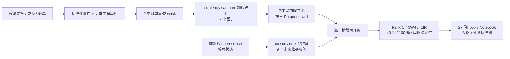

# 主动算法关注度因子：从构造到 2025 年 7 月中期评价

本文汇总26.7.10~7.13之间真正落地的成果。

> **当前结论是 2025 年 7 月的中期探索结果。** 实际可评价窗口为 2025-07-01 至 2025-07-18，共 14 个交易日。

## 1. 本阶段交付了什么

本阶段把“订单事件里的算法痕迹”推进成了一条可以批量生产、评价和复核的完整链路：

| 交付 | 已落地内容 | 当前产物 |
|---|---|---|
| 数据基础 | 深市普通股 PIT 股票池、L2 可得性、上市/退市、ST/新股状态；前复权开收盘价与停牌状态缓存 | 14 个有效交易日，2858 只股票，39941 个股票日 |
| 因子生产 | 9 类订单痕迹 × 笔数/数量/金额 3 种权重 | 27 个 `attn__*__share` 因子，当前有效面板无因子缺失值 |
| 工程流水线 | 按日分片、manifest 指纹、断点续跑、原子写入、按日并行和单日失败隔离 | 可重复生成全市场 attention panel |
| 评价体系 | 9 个未来收益标签、逐日横截面 RankIC、Pearson 对照、ICIR、NW-t、周度稳定性、40 组收益、100 等宽箱与诊断表 | `factor_lab.py` 与汇总 CSV |
| 可视化与研究入口 | 每个因子 4 张标准图、完整表格、已执行 Notebook；另有通用模板和批量生成脚本 | 27 份可直接打开的 Notebook |
| 质量复核 | L3、报告、RQData、因子、配置、PIT 股票池、面板和并行调度回归测试 | 本次复核 **55 passed**；27 份 Notebook 输出均可读取 |

整条已实现链路如下：

## 2. 如何构建因子

### 2.1 因子的共同定义

每个因子都以“股票—交易日”为一行。先从逐笔事件重建订单生命周期，再判断每笔订单是否命中某类痕迹。对同一个痕迹分别计算三种无方向占比：

| 权重 | 分子 | 分母 | 含义 |
|---|---|---|---|
| `count` | 命中订单笔数 | 当日全部有效订单笔数 | 该痕迹在订单数量中的占比 |
| `qty` | 命中订单的申报数量 | 当日全部有效申报数量 | 该痕迹在委托量中的占比 |
| `amount` | 命中订单的申报数量 × 有效价格 | 当日全部有效委托金额权重 | 该痕迹在委托金额中的占比 |

金额优先使用申报价；对少量无有效申报价的订单，回退到第一笔成交价。所有因子均为 unsigned share，不区分买卖方向，数值越高只表示这类行为在当天订单活动中占比越高。

### 2.2 九类痕迹

| 痕迹 | 当前代码中的实际口径 |
|---|---|
| `ee` | `EEMethod.flag_ee` 命中的 EE 痕迹 |
| `fast_cancel_500ms` | 下单后 0.5 秒内撤单 |
| `fast_cancel_1s` | EE 第一步的 1 秒快速撤单标记 |
| `fast_cancel_2s` | 下单后 2 秒内撤单 |
| `fast_cancel_10s` | 下单后 10 秒内撤单 |
| `cancel_any` | 存在有效撤单时间的订单 |
| `taker` | 生命周期中被识别为主动成交方的订单 |
| `sruns` | `CCPMethod.flag_ccp_sruns` 命中的相似/策略性订单序列 |
| `core_union` | `ee` 与 `sruns` 的并集 |

9 类痕迹乘以 3 种权重，得到 27 个冻结列，例如 `attn__fast_cancel_1s_count_share`、`attn__cancel_any_qty_share`。

### 2.3 数据范围和可复现性

当前股票池是按日期构造的深市普通股 PIT 股票池：交易所为 XSHE、证券类型为普通股、代码以 0/3 开头，并检查当日是否已经上市、是否尚未退市以及是否存在 L2 数据；ST 和上市未满 60 天状态也会保留在辅助列中。

最终研究面板包含：

- 2025-07-01 至 2025-07-18，共 14 个交易日；
- 每日 2851 至 2855 只股票，日均 2852.93 只；
- 2858 只不同股票，合计 39941 个股票日；
- 27 个因子列均成功生成，`factor_status` 为 `ok`；
- 标签缺失率最高约 0.11%，主要来自收益腿停牌或价格不可得。

工程上已经支持按日 shard、manifest 指纹校验、已完成日期跳过、原子写入、代码批量读取、按日多进程，以及某一天失败时不取消其他日期。此前为提速完成的生命周期计算和有效价格向量化，也已经进入最终代码，而不是停留在 benchmark 记录中。

## 3. 目前已经实现的评价体系

这是本阶段最核心的成果。它不是只算一列总 IC，而是同时回答“因子是否有横截面排序能力、对应哪一段收益、跨天是否稳定、分组是否单调、极端取值是否只是小样本、标签和因子本身是否健康”。

### 3.1 九个未来收益标签

对每个因子日 (t)，使用前复权价格构造 3 个收益家族、1/2/3 个交易日三个期限：

\[
ret_{cc,h}=\frac{Close_{t+h}}{Close_t}-1
\]

\[
ret_{co,h}=\frac{Open_{t+h}}{Close_t}-1
\]

\[
ret_{oc,h}=\frac{Close_{t+h}}{Open_{t+1}}-1
\]

其中 \(h\in\{1,2,3\}\)。如果收益对应的价格腿停牌或不可用，该标签记为 NA，不做停牌价格前向填充。正式配置仍把 close-to-close 设为 primary family；当前研究 Notebook 为便于观察隔夜效应，额外把 `ret_co_1d` 作为分布图和逐日图的重点展示标签，但九个标签都会完整评价。

### 3.2 每日横截面 IC

每个交易日、每个标签单独计算股票间的相关性：

- **Spearman RankIC 为主指标**，只看横截面排序关系；
- **Pearson IC 为辅助对照**，检查结果是否依赖线性幅度；
- 当天有效股票少于 30 只时不计算；当前正式窗口每天约 2853 只，不存在小横截面问题；
- 每日先计算 IC，再跨天汇总，避免把 39941 个股票日直接当成独立样本。

### 3.3 跨日汇总与显著性

每个因子 × 每个标签输出：

| 指标 | 作用 |
|---|---|
| `mean_ic` | 14 个逐日 RankIC 的均值 |
| `std_ic` | 逐日 RankIC 的样本标准差 |
| `icir_raw` | `mean_ic / std_ic`，不年化 |
| `pos_share` | RankIC 大于 0 的交易日占比 |
| `t_naive` | 把逐日 IC 当作独立样本的普通 t 值 |
| `t_nw` | 对逐日 IC 序列做 Newey–West 修正；1/2/3 日标签固定使用 1/2/4 阶滞后 |
| `mean_pearson` | 每日 Pearson IC 的跨日均值 |

另按 ISO 周输出周均 IC、正天占比和有效天数，用于观察结果是否只集中在某一周。

### 3.4 两种分组检查

评价体系同时保留“等人数分组”和“等因子值分箱”，两者回答的问题不同。

1. **40 个平均秩分位组**：每天先按因子平均秩分成 40 组，再计算各组九个标签的平均未来收益。当前每组每日约 71 只股票。分组发生在删除标签 NA 之前，因此不同标签不会因为缺失值而改变分组成员。
2. **100 个等宽因子值箱**：share 因子固定使用 `[0,1]`，保留空箱，汇总每箱股票日数和九个标签的平均收益。画图时只展示至少 5 个股票日的箱，避免极少数尾部样本制造夸张均值；完整箱表仍保存在 `res['bins']`。

下面是 `attn__cancel_any_qty_share` 的等宽箱示例。上图是因子取值的真实分布，下图是在同一因子值轴上的 `ret_co_1d` 平均收益。图中也能看出，高因子值尾部样本较稀疏，因此尾部单箱的巨大收益不能脱离 count 解读。

### 3.5 健康度和可得性审计

每个 Notebook 还会输出：

- 每日股票数；
- 因子零值占比；
- 唯一值数；
- 最大重复值占比；
- 九个标签各自的 NA 率与有效观测数。

这些字段用于识别“因子看似有 IC，实际只有少数取值”或“某个标签因为缺失太多而不可比”等问题。

### 3.6 四张标准图和完整 Notebook

每个因子统一生成四张图：

1. 40 组九标签平均未来收益；
2. 因子分布（上）与按因子值统计的 `mean ret_co_1d`（下）；
3. `ret_co_1d` 的逐日 RankIC 与累计值（上），九标签累计 RankIC（下）；
4. 2×2 标签概览：mean RankIC、Newey–West t、隔夜/日内对比、标签 NA 率。

下图展示 `attn__fast_cancel_1s_count_share` 的标签概览。该图把“效应多大”“经自相关修正后是否稳定”“主要来自隔夜还是日内”“标签是否缺失”放在同一页，避免只挑最好看的单一 IC。

实现入口为 `research/factor_lab.py`；`factor_template.ipynb` 提供单因子研究模板，`build_factor_notebooks.py` 可以批量生成并执行 27 份 Notebook。每份 Notebook 已包含图和表，打开即可复核，也可在新 shard 到位后 Run All 刷新。

## 4. 当前因子表现怎么样

### 4.1 总体概况

先看当前 Notebook 重点展示的 `ret_co_1d`：

- 27 个因子中 **17 个 mean RankIC 为正，10 个为负**；
- mean RankIC 中位数为 **0.0176**，范围为 **-0.1028 至 0.0784**；
- 10 个正向因子和 4 个负向因子的 `|NW-t| ≥ 2`，合计 14 个；
- 最强正向信号集中在“撤单占比、快速撤单笔数、相似订单序列笔数”；
- 最强负向信号集中在 `taker` 的数量和金额占比。

`ret_co_1d` 排名前七的冻结因子如下：

| 因子 | mean RankIC | raw ICIR | 正天占比 | NW-t |
|---|---:|---:|---:|---:|
| `attn__cancel_any_qty_share` | 0.0784 | 1.5935 | 100.00% | 6.4849 |
| `attn__cancel_any_amount_share` | 0.0763 | 1.5597 | 100.00% | 6.3310 |
| `attn__cancel_any_count_share` | 0.0568 | 1.2467 | 85.71% | 5.1295 |
| `attn__sruns_count_share` | 0.0548 | 2.6271 | 100.00% | 10.7576 |
| `attn__fast_cancel_1s_count_share` | 0.0485 | 1.6338 | 92.86% | 5.8928 |
| `attn__fast_cancel_500ms_count_share` | 0.0448 | 1.3510 | 92.86% | 4.7720 |
| `attn__fast_cancel_2s_count_share` | 0.0440 | 1.7935 | 92.86% | 6.1362 |

如果只做描述性比较，把九个标签的 mean IC 直接平均，跨标签最全面的是快速撤单的笔数口径：

| 因子 | 九标签平均 mean IC | 正向标签数 | `|NW-t| ≥ 2` 标签数 |
|---|---:|---:|---:|
| `fast_cancel_1s_count` | 0.0522 | 9/9 | 7/9 |
| `fast_cancel_500ms_count` | 0.0505 | 9/9 | 7/9 |
| `fast_cancel_2s_count` | 0.0481 | 9/9 | 5/9 |
| `cancel_any_qty` | 0.0412 | 9/9 | 7/9 |
| `sruns_count` | 0.0395 | 9/9 | 1/9 |
| `cancel_any_amount` | 0.0393 | 9/9 | 7/9 |

这个“九标签平均”不是正式合成分数，因为不同期限收益彼此重叠、标签也并非独立；这里只用于说明信号广度。

### 4.2 `cancel_any_qty`：当前 `ret_co_1d` 平均 IC 最高

`attn__cancel_any_qty_share` 衡量当天被撤订单在总申报量中的占比。它在当前 14 天里：

- `ret_co_1d` mean RankIC 为 0.0784，27 个冻结因子中最高；
- 14/14 天 RankIC 为正，raw ICIR 为 1.5935，NW-t 为 6.4849；
- 九个标签 mean IC 全部为正，九标签描述性均值为 0.0412；
- 累计 `ret_co_1d` RankIC 持续上行，没有由单日极端值一次性抬高。

该因子目前最值得继续验证，但分布右尾较稀疏；后续应重点看较高分位组能否在完整 7 月和样本外窗口保持，而不是直接追逐个别极端等宽箱。

### 4.3 `sruns_count`：`ret_co_1d` 的跨日稳定性最好

`attn__sruns_count_share` 衡量相似/策略性订单序列在订单笔数中的占比。它的 `ret_co_1d` mean RankIC 不是最高，但波动最小：

- mean RankIC 0.0548；
- 14/14 天为正；
- 日 IC 标准差只有 0.0209；
- raw ICIR 2.6271，为 27 个因子最高；
- NW-t 10.7576，也是 27 个因子最高。

需要同时看到它的边界：九个标签虽然全部为正，但只有 `ret_co_1d` 的 `|NW-t|` 达到 2。它更像当前窗口里非常稳定的隔夜排序信号，暂不能据此宣称所有期限都同样强。

### 4.4 `fast_cancel_1s_count`：九标签覆盖最全面

`attn__fast_cancel_1s_count_share` 的优势是广度：九个标签 mean IC 全部为正，九标签平均 0.0522 居首，其中 7 个标签的 `|NW-t| ≥ 2`。在 `ret_co_1d` 上 mean RankIC 为 0.0485，13/14 天为正。

40 分组图中，多数收益曲线从低因子组到高因子组整体抬升，尤其 2/3 日标签较明显；曲线仍有局部回撤，因此更准确的说法是“总体排序关系较强”，而不是严格单调。

### 4.5 权重口径揭示了一个重要差异

同一类痕迹用 count、qty、amount 三种权重后，结果并不等价：

- 对快速撤单和 sruns，**count 口径明显强于 qty/amount**，说明信号更接近“行为出现得有多频繁”，而不是“大单占了多少量”；
- 对 `cancel_any`，qty 和 amount 的 `ret_co_1d` 表现强于 count，说明被撤数量/金额占比含有额外信息；
- `taker_count` 的 `ret_co_1d` mean IC 为小幅正的 0.0216，但 `taker_qty` 与 `taker_amount` 分别为 **-0.1028** 和 **-0.1021**，14 天正向占比均为 0，NW-t 约为 -8。

这意味着“主动成交订单很多”和“主动成交数量/金额占比高”不是同一件事。当前窗口里，后者是非常强的反向腿，也是组合因子提升的主要来源。

### 4.6 探索组合 `cancel_minus_taker`

在冻结 27 因子之外，最终产物还保留了一个探索组合：

`cancel_minus_taker = cancel_any_qty_share - taker_qty_share`

它把正向的撤单量占比与负向的主动成交量占比合在一起。在当前 14 天中：

- `ret_co_1d` mean RankIC 为 **0.1156**；
- raw ICIR 为 **1.8103**；
- 14/14 天为正；
- naive t 为 **6.7736**；
- 九个标签 mean IC 全部为正，范围为 0.0372 至 0.1156。

该组合是看过同一窗口结果后形成的，图标题也明确标注为 “exploratory, outside PLAN13 report”。它可以作为下一阶段候选，但不能与 27 个预先冻结的因子放在同一证据等级，更不能用本窗口的高 IC 直接当成样本外表现。

## 5. 其他已经落地的成果（不重要）

### 5.1 原有 evalv2 的 L3 时间分布指纹完成重构

区间起点的两次 L3 修复不是文档修改，而是实质代码重构：订单寿命和到达间隔分布提取、可比组构造、KS/Wasserstein 距离、分层置换检验、反循环排除、可用证据字段和逐因子报告均已进入 `evalv2/timescale.py` 与 `evalv2/report.py`，并补充回归测试。它仍服务于原有“因子机制体检”，与本次 PLAN 13 的未来收益评价互补。

### 5.2 RQData 抓取与缓存基础设施得到复用

早期的 targeted fetch 方向后来没有作为本阶段主线继续，但其中已经实现的 RQData 批量抓取、schema 标准化、分片缓存和命令行入口被保留下来，并在后续用于 PIT 股票信息、ST 状态、复权开收盘价和停牌状态。这里计入的是被最终流水线实际复用的基础设施，而不是当时未继续的选样方案。

### 5.3 工程卫生和运行效率

- 清理并停止跟踪 Python cache；
- 生命周期热点路径优化；
- 有效价格常见路径向量化；
- 原始逐笔数据按股票批量读取，避免一只股票反复扫描文件；
- 从单日串行推进到按日并行、失败隔离和可恢复 shard；
- 基于 raw 文件元信息、配置和因子 registry hash 做 stale shard 检查。

这些改进最终落在 `attention.py`、`attention_panel.py`、`attention_parallel.py`、`lowlat/lifecycle.py` 和 `lowlat/runs.py` 中。

## 6. 当前限制与下一步

1. **时间窗口短。** 当前只有 14 个交易日，Newey–West t 虽已修正自相关，但无法替代更长样本；完整 7 月和后续月份可能改变排序。
2. **当前只覆盖深市普通股。** PIT 逻辑已经稳定，但尚未把同口径生产扩展到沪市。
3. **没有做中性化。** 配置中 `neutralize: false`，结果可能混入规模、流动性、波动率或行业暴露；后续应在保持当前原始评价的同时增加中性化对照。
4. **27 个因子存在同源性。** amount 与 qty、不同快速撤单阈值之间高度同源，不能把多个相近结果当作独立证据；应补充相关矩阵和去冗余组合。
5. **尾部箱需看样本数。** 等宽箱高值区样本少，图上极端收益只用于诊断，优先依据逐日 RankIC、40 分组和跨期复现。
6. **组合必须样本外验证。** `cancel_minus_taker` 是本窗口事后组合，应冻结公式后在未参与选择的日期验证，再决定是否进入 registry。

下一阶段最有价值的顺序是：补齐 2025 年 7 月全月 → 固定候选和方向 → 增加中性化/行业对照 → 在后续月份做样本外复现 → 再决定是否把组合和优选因子晋升为正式研究结论。

## 7. 一句话总结

> 本阶段完成了从逐笔订单生命周期、PIT 全市场日面板，到九标签逐日 RankIC、显著性、分组、分布、稳定性和可复现 Notebook 的完整评价体系。
>
> 当前最值得继续跟踪的是 `cancel_any_qty` 的高平均 IC、`sruns_count` 的强跨日稳定性，以及 `fast_cancel_1s_count` 的九标签广度；`cancel_minus_taker` 提供了更强但仍需样本外验证的探索方向。
